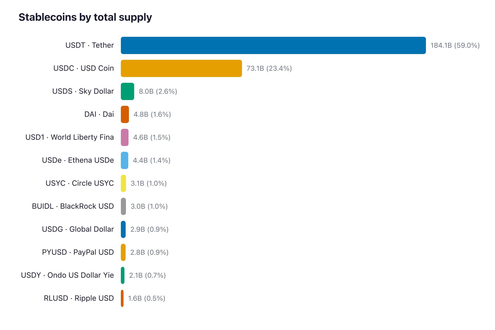
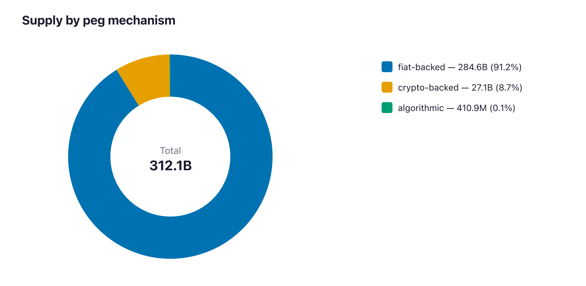
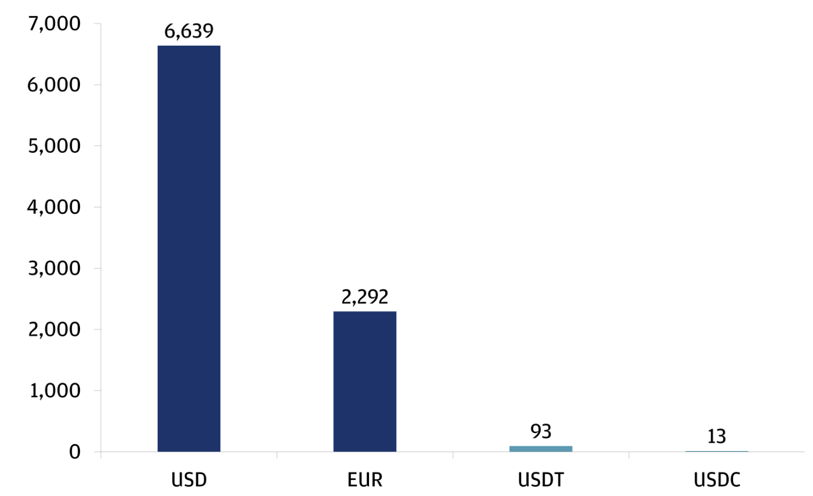
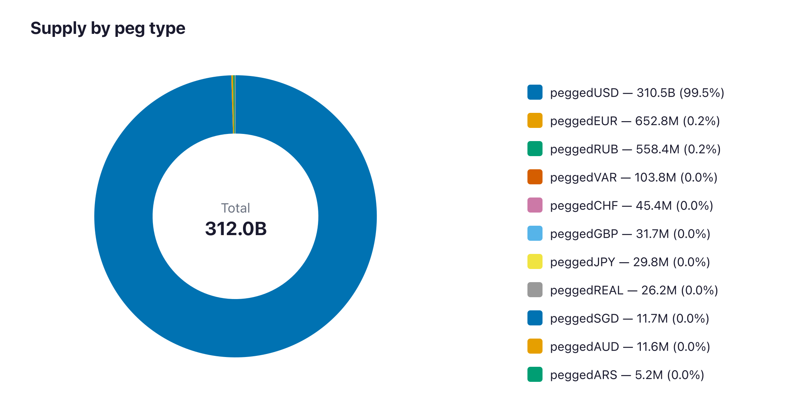

A New Perspective on Stablecoins 
===

### Executive Summary 

- **Fiat-collateralized players like USDT, USDC dominate the markets.**  Top-3 concentration: 85.0% (USDT 59%, USDC 23.4%, USDS 2.6%); top-10 = 93.2% : refer Chart - 1

- Stablecoins can be used in a lending protocol,  Cross-border payment  and Treasury & Deposit where we have high inflation that don’t have access to USD Stable coins. Apart from that I see moat includes Tokenization, Merchant payment, Compliance and Privacy.

- Currently, ~ 99% of stablecoin and global payments are pegged to USD. As stablecoins become an important global payment tool, we must brace ourselves for substantial consequences. 

- Stablecoins hold significant promise for improving financial inclusion and the efficiency in payment systems. But they need to reach a better balance between Privacy and Compliance.

- When ever we evaluate , there are three view that we can look for. 
The Pros (Stable coin and their moat),
The Cons  (The substantial consequences),
Your view (based on your thoughts)

## What are Stablecoins
Stable coins are a type of cryptocurrency where they designed to maintain a fixed value, like 1:1 to a stable fiat asset like USD, Euro, or commodities like Gold.

As per my research using DefiLlama Stable coin API, we can see, 
> Fetch stablecoins and their total (circulating) supply from the
[DeiLlama stablecoins API](https://api-docs.defillama.com/#tag/stablecoins).

### Stablecoins by Supply 

> Chart - 1 : Stable coins by supply , Source: DefiLlama , Data as 4.July.2026 - [[10]](#10)
 
The chart indicates that Fiat-collateralize players like USDT, USDC have strong penetration in stablecoin eco-system. Which include  [[1]](#1)
- Early into the system
- Strong Distribution to wallets 
- Regulatory and Compliance 
- Used as store of value and easy Transfers 
- Used in DeFi Protocol  

### Stablecoins by Peg Mechanism

> Chart 2: Stablecoin with pegged mechanism  type, Source: DefiLlama , Data as 4.July.2026 - [[10]](#10)

The mechanism behind the stablecoin type determine far more than how it holds it peg. It shapes how regulators classify it, what compliance obligations apply. Where risk is concentrated who bear responsibility when something goes wrong. 

**Fiat-collaterized stablecoins**
- Risk center to issuer, who holds the reserves, what those reserve consit of and whether redemptions could be restricted during stress events. 

**Crypto-backed stablecoins**
-  The risk sits in the protocol itself: collateral volatility, oracle reliability and governance quality.

**Algorithmic stablecoins**
- Algorithmic stablecoins rest entirely on market confidence, with no asset backing to fall back on.

## Characteristics of Good Stablecoin
We will compare this with,
> **The PEG : Fiat-collateralized stablecoins vs traditional currency**

To compare fiat-collateralize stablecoins, the most opt analogy within traditional financial world is currencies that maintains a fixed exchange rate. 
we are using Hong Kong dollar (HKD) to understand successful peg. 

The HKD's peg to the USD is widely regarded as one of the most successful in history. It has withstood numerous extreme market conditions.  [[2]](#2)
- During 1997 Asian financial crisis, other Asian currencies forced to depeg and eventually gives up  their forex rates. HKD remained steadfast.
- Stedfast in 2008 Global Financial Crisis, 2015 China Equity Collapse
- COVID-19-induced market collapse in 2020

The successful peg not look glamorous by providing high yield returns, but also sufficient confidence to prevent onset of "**run dynamic**". Which depends on 
- First, **a commitment to maintain a backing ration of 100% or more**. This is crucial to for markets to assure full redemptions can always be met.
    - For HKD - 111.5% as of June. Maintained between 105% and 112.5% [[3]](#3)
    - For USDT - Slightly above 100%, with a 3% “excess reserve” as of June [[5]](#5)

- Second, **the asset allocation within the backing portfolio should be primarily designed to handle large redemption events, rather than to generate financial returns**. This ensure the ability to meet larger redemption in both normal and stressful times. 
    - HKD: Backing asset managed by the Exchange Fund in a segregated portfolio with high-quality, highly liquid US dollar-denominated assets. [[4]](#4)	
    - USDT: Cash and equivalent (U.S. treasury bills, reverse repos, etc) accounts for roughly 80%; rest include secured loans, bitcoin, gold, and other investments [[5]](#5)

To maintain, consistent adherence to these two principles is not easy, which is why many pegs have failed in the history of currencies. 

## Stablecoin Usecases 

### Privacy & Compliance 
In a payment system Privacy & Compliance are traditionally  competing forces. 

#### The problems in Privacy
Privacy in the context of stable coins include, 

**Individual**
- Major concered is the protection of personal info, name, home address, phone number.

**Corporations & Institutions**
- Transaction metadata, such as amounts, timestamp, patterns & counter parties which may have sensitive information comercially. 

**Business**
- Maintaing confidentiality is not only stratgically important, it is often also a legal requirement. 

#### The problems in Compliance 

**KYC Standards** 
- Currently stablecoin providers delegate compliance task to cex & other custodians that provide on-ramp & off-ramps for conversion b/w stablecoin and traditional currencies.
- But in Dex, we have ability to mint stablecoins and move them across multiple accounts with in protocols. With **Mixers** users can obscure transactions, making not easily trace.
- Law inforcement has limited reach and is often reactive, triggered only after suscpicious activity detected. As a result  compliance with AML, CFI & sanctions frameworks in relatively ineffective. 

#### Solution
> <i> Stablecoins hold significant promise for improving financial inclusion & their efficiency of payment systems. **But they need to reach a much better balance b/w Privacy & Compliance** "</i>

Reconciling privacy standards with regulatory compliance, calls for a model that better protects users data while reasonably enforcing law. 

This requires way to verify identities without exposing them.
For privay preserving, Zero Knowledge Proofs (ZKPs) can allow users of a dex payment system to demonstrate kyc , customer compliance with out reveling their personal data. 

### Tokenization in RWA

Stablecoins provide settlement for tokenized assets which open new possibilities for core capital market functions such as 
- Fundraising 
- Equity 
- Debt financing 

Programmability enlarges set of feasible policies deeply unify the way capital flows across borders and asset classes.

Tokenization could rewires the corresponding banking system allowing for messaging, reconciliation & asset transfer in single action. 

> <i> New functions like atomic settlement and enhanced collateral management could drastically improve the functionality of Capital markets these functions lay foundation for Capital markets. </i>

### Merchant Payments

Currently stablecoins have been used  with Crypto payment gateways to provide service in real world e-commerce platform like Shopify and other. 

This will unlock new way as Merchant payments, which will avoid, 
- Credit card fees 
- Charge back risks

If stablecoins has strong penetration towards Merchant payments integration, it has strong foundation and good definsible revenue. 

### Cross border Payments

Stablecoins are still far from challenging the dollar's dominance in daily cross-border transactions

> Chart contains Average daily trading volume, USD billions

> Chart 3: Sources: Coingecko, BIS Triennial Central Bank Survey, Haver Analytics. Data as of August 26, 2025. Foreign exchange turnover data for USD, EUR are as of April 2022. 

Currenlty the US Dollar  taking the lead in 

| Functionality   | Dominant of US Dollar |
| -------- | ------- |
| Transactions   |  90% Forex txs    |
| Central bank reserves | 58% central bank reserves     |
| Debt issuance    | 66% international debt    |
| Trade settlement     |  48% SWIFT txs    |

Here, stablecoin can use this to move towards cross border payments. Currenlty its applications in payments and remittances quite limited.  While rapid expansion in this are could create  moat for stablecoin and decrease the dollar usage. 

However, it may also have more significant impact on banking and financial system.

---
## The things no one talks about 

### De - Dollarizartion
><i>
**In a world where stablecoins particularly those pegged to the Dollar, become an important global payment tool, we must brace ourselves for substantial consequnce.**
</i>

Based on Reference from Chart-1,  

According to Tether, it's exposure to U.S treasury securities exceeded $127 billion at the end of Q2 2025, making it one of the largest holders of U.S. government debt globally.

How ever, a key consideration is whether a stable coins issuers are creating new demand for Treasury bills or simply shifting existing demand from  sources like bank deposit or money market funds. 

### Stablecoins by Peg Type

> Chart 3: Stablecoin with pegged currently type, Source: DefiLlama , Data as 4.July.2026 - [[10]](#10)

If you see Chart-3,  clearly we have majority percentage **pegged to USD**.

There are steps towards de-dollarization but it's still early and we have problem in them too 
- Lack of Depth: There is no equivalent global demand for holding digital Euros or digital Yen in the same way there is for the Dollar.

- Capital Controls: China has banned private stablecoins entirely, promoting their own CBDC (e-CNY) instead. The Eurozone has been slow to regulate private stablecoins (MiCA framework is new), leaving a vacuum.

### Depeg of Stablecoin
> **Like many financial innovations before them, they appear safe only as long as confidence holds**

We already have evidence of most of algorithmic  stable coin depeg issues. 

**Terra UST:** 
- An algorithmic stable coin aimed to maintain 1:1 peg with the US Dollar, through a mechanism involving the Luna Cryptocurrency. 
- Before it collapse it reached market cap of $18B. In May 2022 UST experiences a massive depeg, dropping as low as $0.30 due to combination of 
    - Market volatility 
    - A loss of confidence in it's underlying mechanism  

**IRON** 

- IRON issued by IRON Finance (A dual token model involving  TITAN ) in polygon network. Because of farming in TITAN pair, the price got volatility due to user buying. 
- Some large TITAN sales were made and the price became volatile, making investors nervous, and leading them to also sell their tokens. [[6]](#6)

Apart from these, 
USDN (Neutrino USD) associated to waves blockchain got same issue dropped to $0.60. 

> <i> All this making less confident on Algorithmic stable coins. But as we don't see any economical / programmable issues from Fiat-collateralize stable coins, we still may feel safe. </i>

## Final Thoughts 

For every product/service we use, its should solve our purpose. Each product/service have it's own Pros & Cons. 
But as a Individual / Bussiness the product we use, that will fulfill our needs, in Stablecoin case
- Regulator privacy & compliance, 
- With deep liquify 
- Strong Backing 
- Especially, provide confidence in people when unknown circumstance comes. 

## Refernces 
- <a id="1">[1]</a> 
[IMF: Finance & Devlopment September 2025 Edition](https://www.imf.org/-/media/files/publications/fandd/article/2025/09/fd-september-2025.pdf)
- <a id="2">[2]</a> 
 [HKD: Line of Defence in Times of Crises](https://www.hkma.gov.hk/eng/key-functions/reserves-management/exchange-funds-statutory-purposes-and-investment-objectives/)
- <a id="3">[3]</a> 
 [HKD: Reserve Backing Ration](https://www.hkma.gov.hk/eng/data-publications-and-research/guide-to-monetary-banking-and-financial-terms/back_ratio/)
- <a id="4">[4]</a> 
 [HKD: Portfolio segregation](https://www.hkma.gov.hk/eng/key-functions/reserves-management/investment-management/portfolio-segregation/)
- <a id="5">[5]</a> 
[Tether: Attestation](https://tether.to/en/transparency/?tab=reports)
- <a id="6">[6]</a> 
[REKT : IRON Finance](https://rekt.news/iron-finance-rekt)

- <a id="7">[7]</a> 
[JPMorgon: Stablecoins, Implications in Financial Markets](https://privatebank.jpmorgan.com/apac/en/insights/markets-and-investing/demystifying-stablecoins)

- <a id="8">[8]</a> 
[Elliptic: Types of Stablecoins](https://www.elliptic.co/blockchain-basics/different-types-of-stablecoins)

- <a id="9">[9]</a> 
[Forbe: De-dollarization](https://www.forbes.com/sites/danielwebber/2026/06/29/will-usd-backed-stablecoins-always-dominate-the-market/)

- <a id="10">[10]</a> [DefiLlama Stable coin API](https://api-docs.defillama.com/#tag/stablecoins/get/stablecoins)
